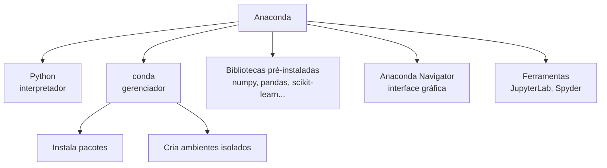
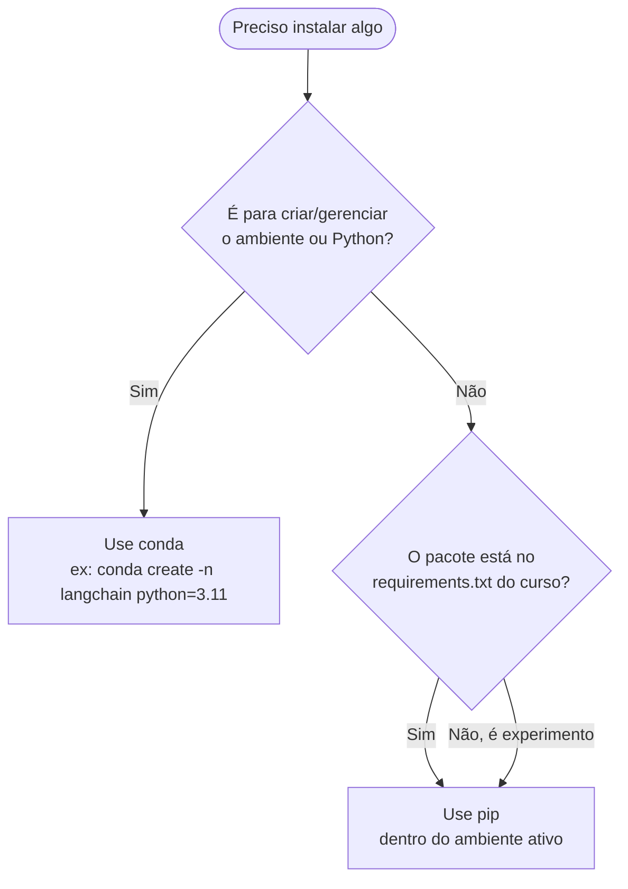
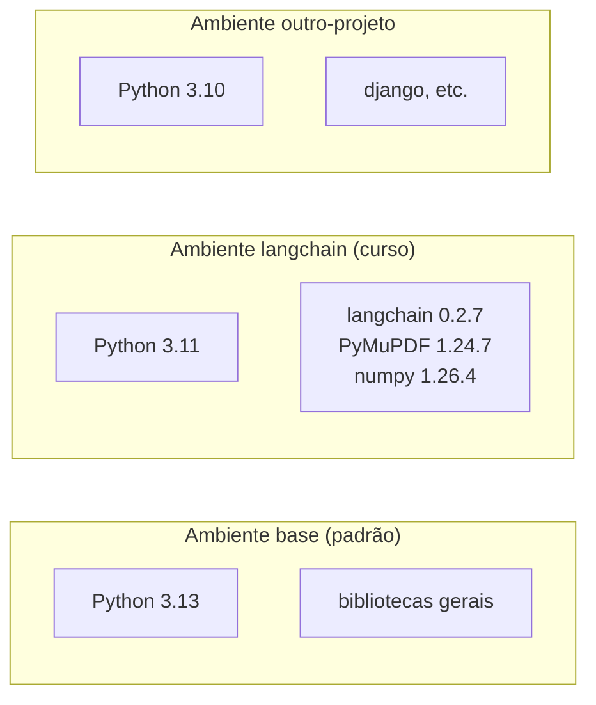
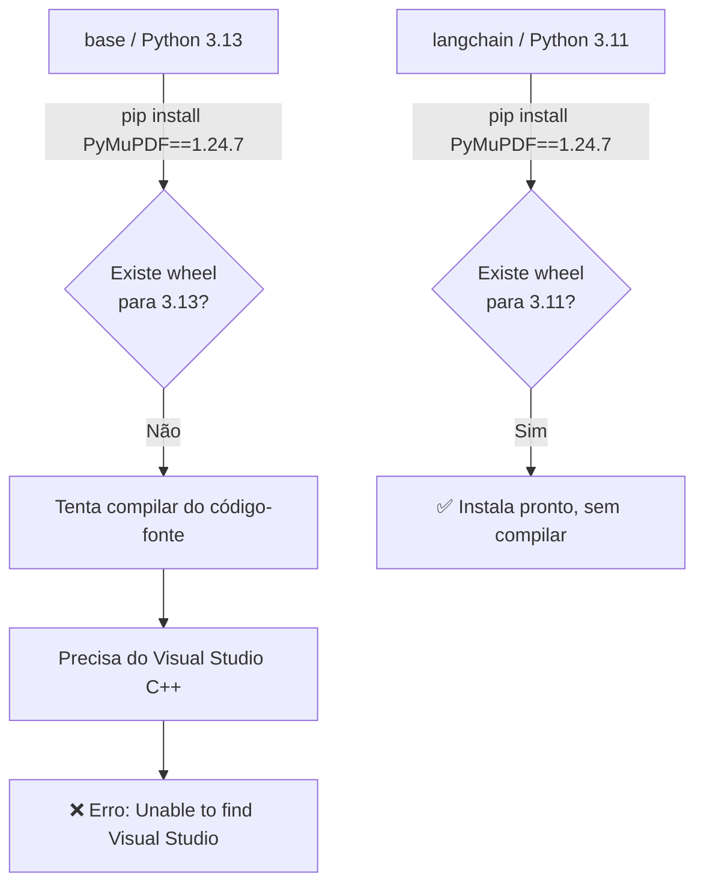

# 01 — Anaconda e conda

> Material de estudo. Explica **o que é o Anaconda**, **o que é o `conda`**, a diferença para o `pip`
> e por que ambientes isolados são importantes. Use junto com o [README](../README.md) (setup prático).

---

## 1. O que é o Anaconda

O **Anaconda** é uma *distribuição* de Python voltada para ciência de dados, machine learning e IA.
Em vez de instalar o Python "puro" e depois cada biblioteca manualmente, o Anaconda já entrega um
pacote completo:

- o **interpretador Python**;
- centenas de **bibliotecas** prontas (`numpy`, `pandas`, `scikit-learn`, `matplotlib`…);
- ferramentas de **gerenciamento** de pacotes e ambientes (`conda`);
- uma **interface gráfica** (Anaconda Navigator);
- ferramentas de trabalho como **JupyterLab** e Spyder.



> **Analogia:** o Python sozinho é como receber só o motor de um carro. O Anaconda é o carro montado —
> motor, rodas, painel e ferramentas, prontos para dirigir.

---

## 2. O que é o `conda`

O `conda` é o **coração** do Anaconda. Ele faz **dois trabalhos diferentes**:

| Papel | O que faz | Comando típico |
|---|---|---|
| **Gerenciador de pacotes** | Instala, atualiza e remove bibliotecas | `conda install numpy` |
| **Gerenciador de ambientes** | Cria "caixas" isoladas, cada uma com seu Python e suas versões | `conda create -n langchain python=3.11` |

A segunda função é a mais valiosa e a que costuma confundir quem está começando.

---

## 3. `conda` vs `pip` — qual usar?

Os dois instalam pacotes Python, mas não são a mesma coisa.

| | `pip` | `conda` |
|---|---|---|
| Origem | Oficial do Python (PyPI) | Anaconda |
| O que instala | Só pacotes **Python** | Pacotes Python **e** bibliotecas de sistema (C/C++, CUDA…) |
| Resolve dependências não-Python | ❌ Não | ✅ Sim |
| Cria ambientes | ❌ Não (precisa do `venv`) | ✅ Sim, nativo |
| Universo de pacotes | Maior (tudo do PyPI) | Menor, porém mais "garantido" no Windows |

### Regra prática deste projeto



> **Boa prática:** dentro de um ambiente conda, prefira instalar tudo com **um** dos dois.
> Misturar `conda install` e `pip install` no mesmo ambiente pode gerar conflitos difíceis de depurar.
> Neste projeto usamos `conda` só para **criar o ambiente** e `pip` para instalar o `requirements.txt`.

---

## 4. Ambientes isolados — o conceito mais importante

Um **ambiente** é uma instalação de Python independente, com suas próprias bibliotecas e versões.
Cada projeto pode ter o seu, sem um interferir no outro.



### Por que isso importa? (caso real deste projeto)

O ambiente `base` do Anaconda veio com **Python 3.13**. As versões fixadas no `requirements.txt`
do curso são de meados de 2024 e **não têm binário pronto** ("wheel") para o 3.13. Resultado: ao tentar
instalar o `PyMuPDF==1.24.7` no `base`, o `pip` tentava **compilar do código-fonte**, o que exige o
Visual Studio C++ — que não estava instalado — e falhava.

A solução foi **criar um ambiente isolado** (`langchain`) com **Python 3.11**, onde todas as versões
têm wheel pronto e instalam sem compilar nada.

> 📄 O passo a passo dessa investigação está em [04 — Resolução de problemas](04-troubleshooting.md).



---

## 5. Comandos essenciais do `conda`

```powershell
# Ambientes
conda create -n langchain python=3.11 -y   # criar ambiente
conda activate langchain                    # ativar (entrar) no ambiente
conda deactivate                            # sair do ambiente
conda env list                              # listar todos os ambientes
conda remove -n langchain --all             # apagar um ambiente

# Pacotes (dentro do ambiente ativo)
conda list                                  # ver pacotes instalados
conda install pandas                        # instalar via conda
pip install -r requirements.txt             # instalar via pip

# Rodar algo num ambiente SEM ativá-lo
conda run -n langchain python script.py
```

> Quando o ambiente está ativo, o terminal mostra o nome entre parênteses no início da linha:
> `(langchain) C:\Projetos\poc-langchain-angular>`

---

## Próximos passos

- 📄 [02 — JupyterLab e notebooks](02-jupyterlab.md)
- 📄 [03 — Ambientes virtuais e kernels](03-ambientes-virtuais.md)
- 📄 [04 — Resolução de problemas](04-troubleshooting.md)
