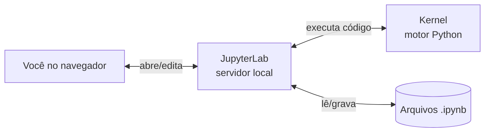
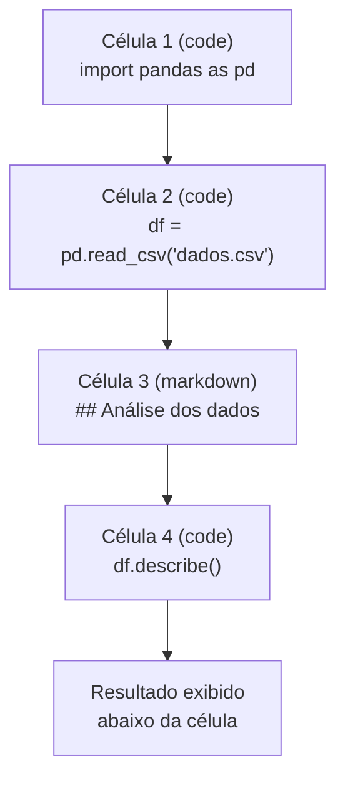
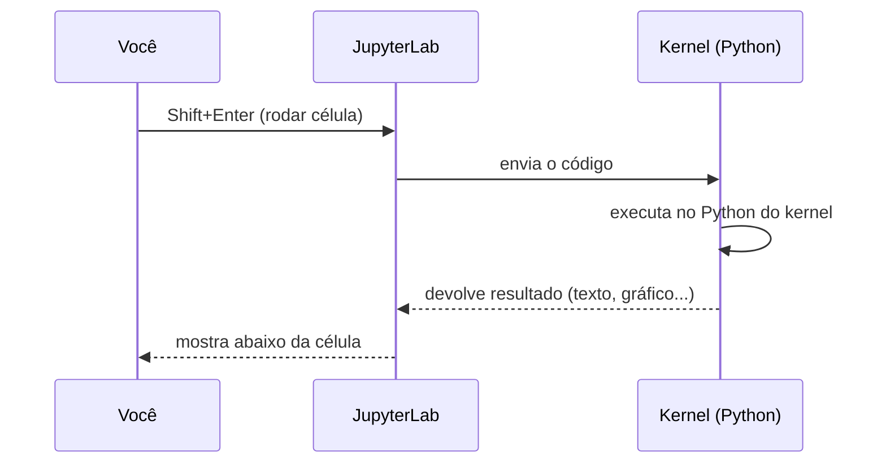
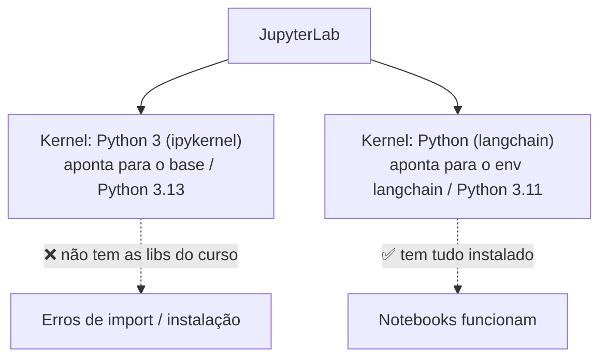

# 02 — JupyterLab e notebooks

> Material de estudo. Explica **o que é o JupyterLab**, como funcionam **notebooks**, **células** e
> **kernels** — e por que a escolha do kernel é o ponto que mais causa confusão.

---

## 1. O que é o JupyterLab

O **JupyterLab** é um ambiente de programação **interativo** que roda no **navegador**. Ele é a evolução
do antigo "Jupyter Notebook" e serve para escrever e executar código em pedaços, vendo o resultado
na hora — ideal para estudo, experimentação e análise de dados.

O coração do JupyterLab são os **notebooks**: arquivos com extensão **`.ipynb`** (como o
`langchain/Install.ipynb` deste projeto).



> O JupyterLab é um **servidor local**: ao rodar `jupyter lab`, ele sobe um endereço como
> `http://localhost:8889/lab` que você abre no navegador. O código roda na sua máquina, não na internet.

---

## 2. Notebooks e células

Um notebook é uma sequência de **células**. Existem dois tipos principais:

| Tipo de célula | Para quê | Exemplo |
|---|---|---|
| **Code** | Código Python executável | `print("olá")` |
| **Markdown** | Texto formatado, títulos, explicações | `# Meu título` |

A grande diferença para um script `.py` comum: você executa **uma célula por vez** (com `Shift+Enter`)
e vê o resultado logo abaixo dela. Isso permite testar um trecho, ajustar e rodar de novo sem
reexecutar o programa inteiro.



### Cuidado: estado compartilhado e ordem de execução

Todas as células de um notebook compartilham a **mesma memória** (o mesmo kernel). Uma variável criada
na célula 1 continua existindo na célula 4. Isso é poderoso, mas tem uma armadilha:

> ⚠️ As células podem ser executadas **fora de ordem**. O número entre colchetes `[ ]` ao lado de cada
> célula mostra a **ordem real** em que foram rodadas. Se algo estranho acontecer, use
> **Kernel → Restart Kernel and Run All Cells** para rodar tudo do zero, de cima para baixo.

---

## 3. Kernel — o "motor" que executa o código

O **kernel** é o processo que realmente roda o código das células. Quando você aperta `Shift+Enter`,
o JupyterLab manda o código para o kernel, que executa e devolve o resultado.

O ponto crucial: **o kernel determina qual Python e quais bibliotecas o notebook usa.**



### Um JupyterLab, vários kernels

Você pode ter **vários kernels** registrados e escolher qual cada notebook usa. Neste projeto temos dois:



> 💡 **A causa de erro mais comum:** rodar o notebook no kernel errado (o `base`/3.13) em vez do
> `Python (langchain)`/3.11. Foi exatamente isso que causou o erro do PyMuPDF mesmo depois de
> instalarmos tudo no ambiente certo. Veja o caso em [04 — Resolução de problemas](04-troubleshooting.md).

### Como descobrir em qual kernel você está

Rode numa célula:

```python
import sys
print(sys.executable)   # mostra o caminho do Python do kernel
print(sys.version)      # mostra a versão
```

- Se aparecer `...\anaconda3\python.exe` e `3.13.x` → você está no **base** (errado para o curso).
- Se aparecer `...\anaconda3\envs\langchain\python.exe` e `3.11.x` → você está no **langchain** (certo ✅).

### Como trocar o kernel

1. Com o notebook aberto, clique no **nome do kernel** no canto superior direito;
2. ou use o menu **Kernel → Change Kernel…**;
3. escolha **`Python (langchain)`**.

---

## 4. Comandos e atalhos úteis

### Terminal

```powershell
jupyter lab --port 8889                 # iniciar o JupyterLab nesta porta
jupyter kernelspec list                 # listar kernels registrados
jupyter server list                     # listar servidores rodando (com token)
```

### Atalhos dentro do notebook

| Atalho | Ação |
|---|---|
| `Shift + Enter` | Rodar célula e ir para a próxima |
| `Ctrl + Enter` | Rodar célula e ficar nela |
| `Esc` depois `A` / `B` | Inserir célula **a**cima / a**b**aixo |
| `Esc` depois `M` / `Y` | Mudar célula para **M**arkdown / código (`Y`) |
| `Esc` depois `D D` | Apagar a célula |
| `Esc` depois `0 0` | Reiniciar o kernel |

---

## Próximos passos

- 📄 [01 — Anaconda e conda](01-anaconda-e-conda.md)
- 📄 [03 — Ambientes virtuais e kernels](03-ambientes-virtuais.md)
- 📄 [04 — Resolução de problemas](04-troubleshooting.md)
