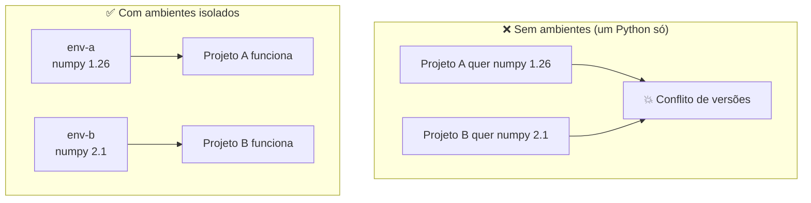
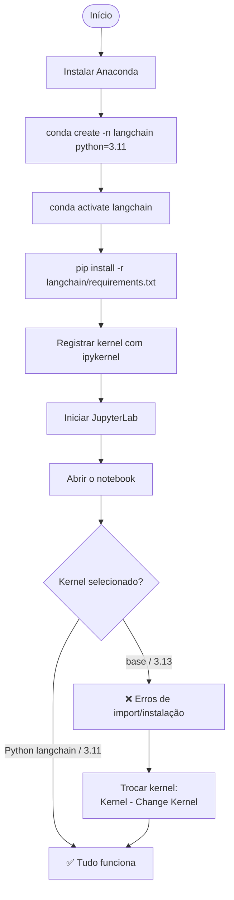

# 03 — Ambientes virtuais e kernels

> Material de estudo. Aprofunda o conceito de **ambiente virtual**, mostra como ele se conecta ao
> **kernel** do JupyterLab e descreve o **fluxo completo** usado neste projeto.

---

## 1. Por que ambientes virtuais existem

Imagine dois projetos na mesma máquina:

- **Projeto A** precisa de `numpy 1.26`;
- **Projeto B** precisa de `numpy 2.1`.

Se houvesse só **uma** instalação de Python, instalar uma versão quebraria a outra. O ambiente virtual
resolve isso dando a cada projeto sua **própria cópia isolada** de Python + bibliotecas.



Benefícios:

- **Isolamento** — um projeto não quebra o outro;
- **Reprodutibilidade** — o `requirements.txt` recria o mesmo ambiente em qualquer máquina;
- **Limpeza** — apagar um ambiente (`conda remove -n nome --all`) não afeta o resto;
- **Versão do Python por projeto** — um pode usar 3.11, outro 3.13.

---

## 2. conda env vs venv

Existem duas formas comuns de criar ambientes em Python:

| | `venv` (padrão do Python) | `conda` (Anaconda) |
|---|---|---|
| Vem com | Qualquer Python | Anaconda |
| Escolhe a versão do Python? | ❌ Usa a que criou o venv | ✅ Sim (`python=3.11`) |
| Instala libs de sistema (C/C++) | ❌ Não | ✅ Sim |
| Comando para criar | `python -m venv .venv` | `conda create -n nome python=3.11` |

Neste projeto usamos **conda**, principalmente porque ele permite **fixar a versão do Python** (3.11) —
que foi a chave para resolver o problema de compatibilidade.

---

## 3. A ponte entre ambiente e JupyterLab: o kernel

Criar o ambiente **não basta** para o JupyterLab enxergá-lo. É preciso **registrar** o ambiente como um
**kernel**. O pacote `ipykernel` faz essa ponte.


O comando de registro foi:

```powershell
conda run -n langchain python -m ipykernel install --user --name langchain --display-name "Python (langchain)"
```

Isso cria um arquivo `kernel.json` que diz ao Jupyter **qual Python** usar:

```json
{
  "argv": [
    "C:\\Users\\Administrador\\anaconda3\\envs\\langchain\\python.exe",
    "-m", "ipykernel_launcher", "-f", "{connection_file}"
  ],
  "display_name": "Python (langchain)",
  "language": "python"
}
```

> A primeira linha do `argv` é o que importa: é o caminho do Python **do ambiente** `langchain`.
> Quando você seleciona esse kernel, todas as células rodam nesse Python — com as libs do curso.

Para conferir os kernels registrados:

```powershell
jupyter kernelspec list
```

---

## 4. Fluxo completo deste projeto (do zero ao notebook rodando)



### Resumo dos papéis

| Camada | Ferramenta | Função |
|---|---|---|
| Distribuição | Anaconda | Traz Python + conda + ferramentas |
| Ambiente | `conda` | Cria a "caixa" isolada `langchain` (Python 3.11) |
| Pacotes | `pip` | Instala as libs do `requirements.txt` na caixa |
| Ponte | `ipykernel` | Registra a caixa como kernel do Jupyter |
| Interface | JupyterLab | Edita e roda os notebooks |
| Execução | Kernel | Roda o código no Python do ambiente certo |

---

## 5. Erros comuns relacionados a ambiente/kernel

| Sintoma | Causa provável | Solução |
|---|---|---|
| `ModuleNotFoundError` para uma lib que você "instalou" | Notebook está no kernel errado | Trocar para `Python (langchain)` |
| Erro ao compilar pacote / `Unable to find Visual Studio` | Instalando no Python 3.13 (sem wheel) | Usar o ambiente com Python 3.11 |
| Kernel `Python (langchain)` não aparece | JupyterLab aberto antes do registro | Reiniciar o JupyterLab |
| Variável "some" entre células | Kernel reiniciado ou execução fora de ordem | **Restart Kernel and Run All** |

> Detalhes do caso real (PyMuPDF) em [04 — Resolução de problemas](04-troubleshooting.md).

---

## Próximos passos

- 📄 [01 — Anaconda e conda](01-anaconda-e-conda.md)
- 📄 [02 — JupyterLab e notebooks](02-jupyterlab.md)
- 📄 [04 — Resolução de problemas](04-troubleshooting.md)
