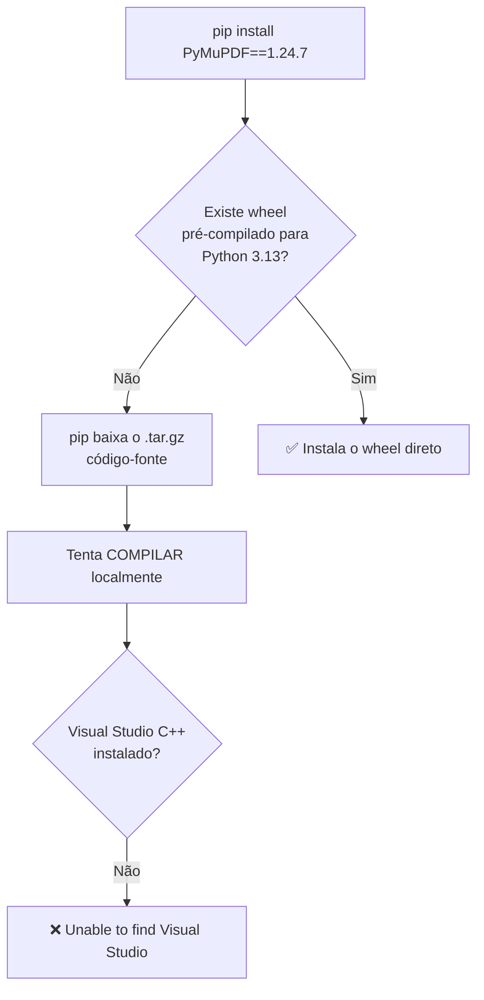
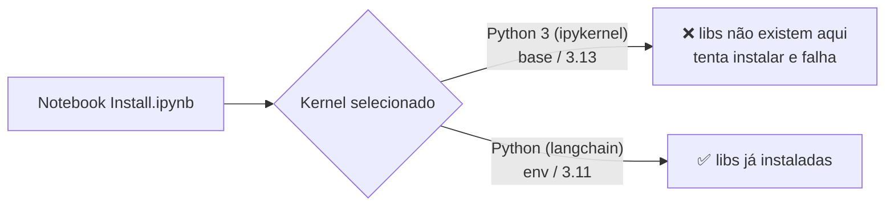
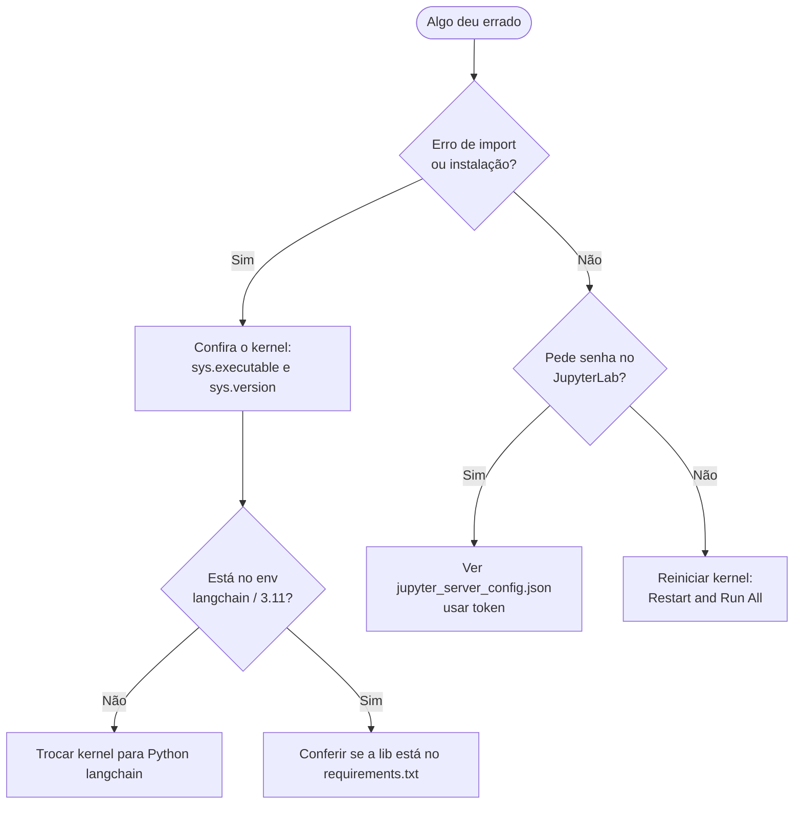

# 04 — Resolução de problemas

> Casos reais enfrentados neste projeto, com a investigação e a solução de cada um.
> Serve tanto como referência rápida quanto como exemplo de **como diagnosticar** problemas de ambiente.

---

## Caso 1 — `Unable to find Visual Studio` ao instalar o PyMuPDF

### Sintoma

Ao rodar a célula de instalação do `Install.ipynb`, o `pip` falhava no `PyMuPDF==1.24.7`:

```
Preparing metadata (pyproject.toml): finished with status 'error'
...
AssertionError: No match found for: C:\Program Files*\Microsoft Visual Studio\2*\*
Exception: Unable to find Visual Studio
error: metadata-generation-failed
```

### Como ler o erro

Duas pistas no log entregam a causa:

```
platform.python_version(): '3.13.9'
Using cached PyMuPDF-1.24.7.tar.gz (31.5 MB)   ← baixou o CÓDIGO-FONTE (.tar.gz), não um wheel
```



**O que é um "wheel"?** É o pacote **já compilado** (`.whl`). Quando existe um wheel para o seu
sistema operacional + versão do Python, o `pip` só baixa e copia — rápido e sem compilador. Quando
**não** existe, ele baixa o código-fonte (`.tar.gz`) e tenta compilar na hora, o que no Windows exige
o Visual Studio C++.

### Causa raiz

As versões fixadas no `requirements.txt` são de meados de 2024. O **Python 3.13** (do ambiente `base`)
é mais novo que elas, então não há wheel `cp313` para vários pacotes (`PyMuPDF`, `numpy==1.26.4`,
`scikit-learn==1.5.1`). No 3.13, o `pip` cai no caminho de compilar → falha.

### Solução

Criar um ambiente isolado com **Python 3.11**, onde todas essas versões têm wheel pronto:

```powershell
conda create -n langchain python=3.11 -y
conda run -n langchain pip install -r "C:\Projetos\poc-langchain-angular\langchain\requirements.txt"
```

No 3.11, o mesmo `PyMuPDF==1.24.7` instala pelo wheel `cp311`, sem compilar nada.

> 📄 Conceito por trás: [03 — Ambientes virtuais](03-ambientes-virtuais.md).

---

## Caso 2 — O erro continua MESMO depois de instalar tudo

### Sintoma

Ambiente `langchain` criado, `requirements.txt` instalado com sucesso… mas ao rodar o notebook o
**mesmo erro do PyMuPDF** reaparece.

### Como diagnosticar

O log do erro mostrava:

```
platform.python_version(): '3.13.9'
CONDA_DEFAULT_ENV: 'base'
sys.executable: 'C:\Users\Administrador\anaconda3\python.exe'
```

Ou seja: o notebook **não estava** usando o ambiente `langchain` (3.11). Ele rodava no kernel do
`base` (3.13) — onde nada foi instalado.



### Solução

Trocar o kernel do notebook (não reinstalar nada):

1. Reiniciar o JupyterLab (para listar o kernel novo);
2. No notebook: canto superior direito → escolher **`Python (langchain)`**
   (ou **Kernel → Change Kernel…**);
3. **Não** rodar a célula de `pip install` — já está tudo instalado.

### Como confirmar que está no kernel certo

```python
import sys
print(sys.executable)   # deve conter \envs\langchain\
print(sys.version)      # deve começar com 3.11
```

> 📄 Conceito por trás: [02 — JupyterLab e kernels](02-jupyterlab.md).

---

## Caso 3 — JupyterLab pedindo senha

### Sintoma

Ao abrir o JupyterLab (via Anaconda Navigator), aparecia a tela **"Password or token"** pedindo senha.

### Causa

Havia uma senha configurada (hash `argon2`) em
`C:\Users\Administrador\.jupyter\jupyter_server_config.json` — e a senha original tinha se perdido.
O hash **não pode** ser revertido.

### Solução

Como é máquina local, removemos a senha para voltar à autenticação padrão por **token**:

```json
{
  "ServerApp": {
    "root_dir": "C:\\Projetos"
  }
}
```

> O arquivo ficou sem `hashed_password`. Foi preciso **reiniciar o servidor** (encerrar o processo
> antigo) para a mudança valer, já que a senha ficava carregada em memória.
> Para definir uma senha nova no futuro: `jupyter lab password`.

---

## Checklist rápido de diagnóstico



| Comando | Para quê |
|---|---|
| `conda env list` | Ver os ambientes existentes |
| `conda run -n langchain pip list` | Ver libs instaladas no ambiente |
| `jupyter kernelspec list` | Ver kernels registrados |
| `jupyter server list` | Ver servidores rodando (com token) |

---

## Voltar ao início

- 📄 [01 — Anaconda e conda](01-anaconda-e-conda.md)
- 📄 [02 — JupyterLab e notebooks](02-jupyterlab.md)
- 📄 [03 — Ambientes virtuais e kernels](03-ambientes-virtuais.md)
- 📄 [README do projeto](../README.md)
