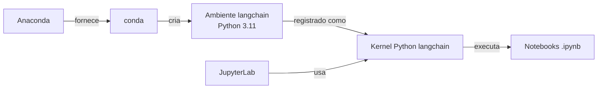

# 📚 Documentação de estudo

Material explicativo sobre as ferramentas usadas neste projeto. Para o **setup prático** (passo a passo
de instalação), veja o [README principal](../README.md). Estes documentos focam em **entender o porquê**.

## Trilha de leitura

1. 📄 **[01 — Anaconda e conda](01-anaconda-e-conda.md)**
   O que é o Anaconda, o que é o `conda`, `conda` vs `pip` e por que ambientes isolados importam.

2. 📄 **[02 — JupyterLab e notebooks](02-jupyterlab.md)**
   O que é o JupyterLab, como funcionam células e o **kernel** (o ponto que mais confunde).

3. 📄 **[03 — Ambientes virtuais e kernels](03-ambientes-virtuais.md)**
   Aprofunda ambientes virtuais, a ponte `ipykernel` e o **fluxo completo** do projeto.

4. 📄 **[04 — Resolução de problemas](04-troubleshooting.md)**
   Casos reais (PyMuPDF, kernel errado, senha do Jupyter) com diagnóstico e solução.

## Como os conceitos se encaixam

> Os diagramas usam **Mermaid**, renderizado nativamente pelo GitHub. No VS Code, instale a extensão
> *Markdown Preview Mermaid Support* para visualizá-los.
